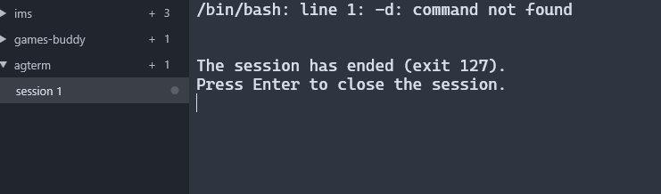

# Shell-exit hold prompt (agterm / libghostty parity)

**Status:** implemented on fork PR #15; tracked in [fork issue #14](https://github.com/agushuley/agwinterm/issues/14).

## Summary

When a **profile / login-shell** tab’s process exits, agwinterm keeps scrollback and appends an **in-terminal** hold message (`Press Enter to close the session.`). **Enter** removes the session tab via `CloseSessionInternal` — **not** `ConfirmCloseOk()` (boolean `confirm-close-session` unchanged for sidebar/menu closes).

## Screenshot

## Scope

- Always on for profile/login-shell tabs; not `session new --command`. No config key.
- The ended tab keeps its scrollback until Enter dismisses it.

## Exit outcome and session chrome

There is no separate exit semaphore. A background exit uses the existing notification path (badge, in-app toast, and optional desktop balloon). The unread-count badge is green only when every unread notification is a successful shell exit; ordinary, failed, and mixed notifications remain red. When shown for an ended shell, the badge tooltip includes the exit code. A focused exit relies on the in-terminal prompt, and the session accessibility name also includes the exit code. The outcome exists only while the ended profile shell is held, and is cleared on dismissal. Agent status remains independent.

## References

- agterm libghostty hold: `GHOSTTY_ACTION_SHOW_CHILD_EXITED` → `closePrimaryPane` after key.
- agwinterm **#71** (split survivor), overlay `--wait` is a different UX (footer / any key).

## Acceptance

1. Profile/login-shell tab: `exit` → hold lines in scrollback; **Enter** closes the session tab.
2. `confirm-close-session = true`: exit-hold **Enter** does not show the generic Close session dialog; manual UI close unchanged.
3. `session new --command` / direct command panes: no exit hold (pane may linger until manual close).
4. No configuration toggle — always on for eligible panes only.

### Completion acceptance

- A successful background exit has a green unread-count badge; a non-zero exit and mixed unread notifications have a red badge.
- The badge tooltip (when present) and accessible name report the ended state and exit code.
- The process outcome produces the specified notification without replacing an independent agent status.

## Out of scope

- `session new --command` / agterm #255.
- Tri-state close confirm (fork prototype #304).
- **agliteterm** backport after fork release per [AGENTS.md](../../../AGENTS.md).
