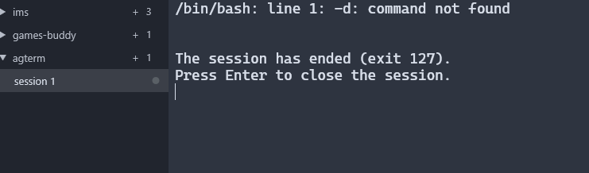

# Shell-exit hold prompt

**Status:** split into a third stacked branch, `feature/shell-exit-enter-hold`, on top of exit notifications; tracked in [fork issue #14](https://github.com/agushuley/agwinterm/issues/14). The older combined fork PR #15 is unchanged.

## Summary

When a **profile / login-shell** tab’s process exits, agwinterm keeps scrollback and appends an **in-terminal** hold message (`Press Enter to close the session.`). **Enter** removes the session tab via `CloseSessionInternal` — **not** `ConfirmCloseOk()` (boolean `confirm-close-session` unchanged for sidebar/menu closes).

## Screenshot

## Scope

- Always on for profile/login-shell tabs; not `session new --command`. No config key.
- The ended tab keeps its scrollback until Enter dismisses it.

## Exit outcome and session chrome

There is no separate exit semaphore. The preceding exit-notifications branch already sends `ok` for exit code 0 and `attention` for a non-zero code. The unread-count badge follows general category priority. The badge tooltip and session accessibility name include the exit code. This branch only adds the in-terminal prompt and Enter-to-close behavior. Agent status remains independent.

## References

- agterm currently closes its primary pane when the shell exits; the Windows hold is a distinct UX choice.
- agwinterm **#71** (split survivor), overlay `--wait` is a different UX (footer / any key).

## Acceptance

1. Profile/login-shell tab: `exit` → hold lines in scrollback; **Enter** closes the session tab.
2. `confirm-close-session = true`: exit-hold **Enter** does not show the generic Close session dialog; manual UI close unchanged.
3. `session new --command` / direct command panes: no exit hold (pane may linger until manual close).
4. No configuration toggle — always on for eligible panes only.

### Completion acceptance

- A successful background exit contributes an `ok` unread notification; a non-zero exit contributes `attention`. Mixed unread messages use the general category priority.
- The badge tooltip (when present) and accessible name report the ended state and exit code.
- The process outcome produces the specified notification without replacing an independent agent status.

## Out of scope

- `session new --command` / agterm #255.
- Tri-state close confirm (fork prototype #304).
- **agliteterm** backport after fork release per [AGENTS.md](../../../AGENTS.md).
